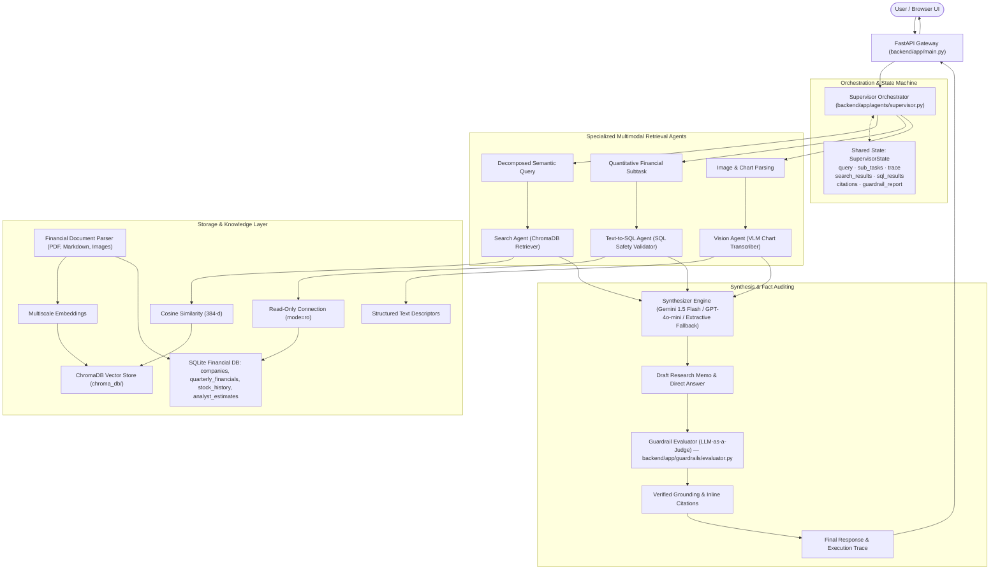

# OmniBrain Studio
### *Agentic Multi-Modal RAG Orchestrator*

[](https://www.python.org/)
[](https://fastapi.tiangolo.com/)
[](https://www.trychroma.com/)
[](LICENSE)
[](tests/)

**OmniBrain Studio** is an enterprise-grade multi-modal Retrieval-Augmented Generation (RAG) platform. It orchestrates specialized agents across dense semantic text search, quantitative financial databases, and visual chart transcription — with automated factual claim auditing to keep every answer grounded in source data.

---

## 🌟 Overview

OmniBrain Studio combines three retrieval modalities behind a single **Supervisor Agent**, allowing users to submit complex queries and receive answers synthesized across unstructured documents, structured financial databases, and visual chart imagery alike:

| Capability | Description |
| :--- | :--- |
| **Dense Semantic Search** | ChromaDB-backed vector retrieval over parsed, multi-scale document embeddings |
| **Text-to-SQL** | Natural-language queries translated into SQL against a structured financial database |
| **Vision Transcription** | A vision-language model (VLM) reads and transcribes charts, tables, and figures from source documents |
| **Factual Auditing** | A NeMo Guardrails / LLM-as-a-Judge layer verifies claims in generated answers against retrieved evidence before they reach the user |

---

## 🏗️ Architecture

A central **Supervisor Orchestrator** decomposes each incoming query into sub-tasks, maintains a shared state object across the run (query, sub-tasks, trace, search/SQL results, citations, guardrail report), and routes work to the appropriate specialist agent(s). Retrieved evidence is synthesized into a draft answer, verified by a guardrail evaluator, and returned with inline citations and a full execution trace.

#### System Diagram



#### Query Execution Flow

```text
[User Query]
     │
     ▼
[Supervisor: Query Decomposition]
     │
     ├──► [SubTask 1: SQL Agent]    ──► [SQLite DB (mode=ro)]   ──► [SQL Rows]
     │
     └──► [SubTask 2: Search Agent] ──► [ChromaDB Vector Store] ──► [Text & Visual Chunks]
                                                                        │
     ┌──────────────────────────────────────────────────────────────────┘
     ▼
[Synthesizer Engine] (Gemini / OpenAI / Extractive Fallback)
     │
     ▼
[Draft Response with Inline References]
     │
     ▼
[Guardrail Evaluator (LLM-as-a-Judge)]
     ├── Factual Claim Extraction
     ├── Evidence Cross-Verification
     └── Hallucination Flagging & Citation Linking
     │
     ▼
[Final QueryResponse: Verified Response + Structured Citations + Full Execution Trace]
```

#### Component Notes

- **Supervisor Orchestrator** (`backend/app/agents/supervisor.py`) — decomposes the query, dispatches sub-tasks in parallel, and owns the shared `SupervisorState`.
- **Search Agent** — retrieves semantically relevant text/visual chunks from ChromaDB via 384-dimensional cosine similarity.
- **Text-to-SQL Agent** — translates natural-language financial questions into validated, read-only SQL against `companies`, `quarterly_financials`, `stock_history`, and `analyst_estimates` tables.
- **Vision Agent** — transcribes charts and figures into structured text descriptors for downstream synthesis.
- **Financial Document Parser** — ingests PDF/Markdown/image source documents, producing multiscale embeddings (ChromaDB) and structured rows (SQLite).
- **Synthesizer Engine** — merges agent outputs into a draft memo/direct answer, with an extractive fallback if the primary LLM is unavailable.
- **Guardrail Evaluator** (`backend/app/guardrails/evaluator.py`) — an LLM-as-a-Judge pass that extracts factual claims, cross-verifies them against retrieved evidence, flags hallucinations, and links inline citations before the final, fully-traced response is returned via the FastAPI gateway.

---

## 📂 Project Structure

```text
omnibrain-multimodal-rag/
├── app/                           # Core application package & CLI
├── backend/                       # FastAPI backend server
│   ├── agents/                    # Multi-agent orchestrators (Supervisor, Search, Vision, SQL)
│   ├── rag/                       # Document parser, multi-scale embeddings, ChromaDB vector store
│   ├── guardrails/                # NeMo / LLM-as-a-Judge factual grounding auditor
│   ├── db/                        # SQLite financial database & seeders
│   └── models/                    # Pydantic schemas & response models
├── chroma_db/                     # Persistent ChromaDB vector storage
├── config/                        # Configuration settings, config.yaml, & system prompts
├── data/                          # Uploaded documents & benchmark filings
├── docs/                          # Architecture diagrams & API documentation
├── frontend/                      # Web UI (Space Grotesk typography, landing page, chat studio)
├── notebooks/                     # Interactive Jupyter walkthroughs
├── tests/                         # Pytest test suite
├── .env.example                   # Environment configuration template
├── .gitignore                     # Git ignore rules (safeguards secrets & cache)
├── conftest.py                    # Pytest configuration
├── requirements.txt               # Dependencies
└── main.py                        # Root launcher script
```

---

## 🚀 Getting Started

### Prerequisites
- **Python 3.10+**
- **pip**

### 1. Installation
Clone the repository and install the dependencies:
```bash
git clone https://github.com/C19Parasite/OmniBrain-RAG.git
cd OmniBrain-RAG
pip install -r requirements.txt
```

### 2. Configuration
Copy the example environment file and configure your API keys and parameters:
```bash
cp .env.example .env
```
*(On Windows PowerShell: `Copy-Item .env.example .env`)*

### 3. Run the Application

OmniBrain provides two user interface frontends to suit production and review requirements:

#### Option A: Streamlit Multimodal Interface (Spec Review Mode)
Launch the dedicated Streamlit interface featuring real-time thought process rendering and side-by-side visual exhibit display:
```bash
streamlit run streamlit_app.py
```
Open your browser at **[http://localhost:8501](http://localhost:8501)**.

#### Option B: Production FastAPI & HTML5 Studio
Launch the production web client served directly by the FastAPI backend:
```bash
python main.py
```
Open your browser at **[http://localhost:8000](http://localhost:8000)**.


---

## 🧪 Testing

Execute the automated test suite with pytest:
```bash
pytest
```

---

## 📚 Documentation & Notebooks

- **Architecture & API Reference**: See the [`docs/`](docs/) directory.
- **Interactive Walkthroughs**: Explore example workflows and evaluations in [`notebooks/`](notebooks/).

---

## 👥 Contributors

- **Udipta Ray**
- **Kalash Jain**
- **Vansh Teotia**
- **Aaryan Rathi**
- **Tushar Kumar Pradhan**
- **Rajeshwari Chetlapalli**

---

## 🤝 Contributing

Contributions are welcome! Please open an issue to discuss proposed changes or features before submitting a pull request.

---

## 📄 License

This project is licensed under the [MIT License](LICENSE).
